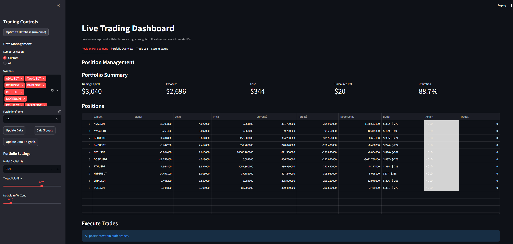
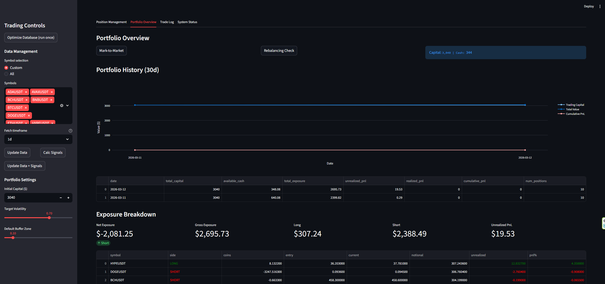
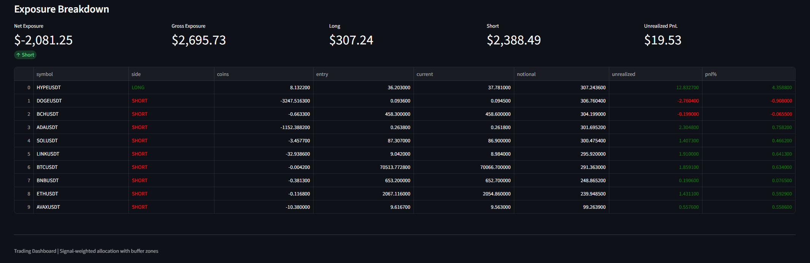
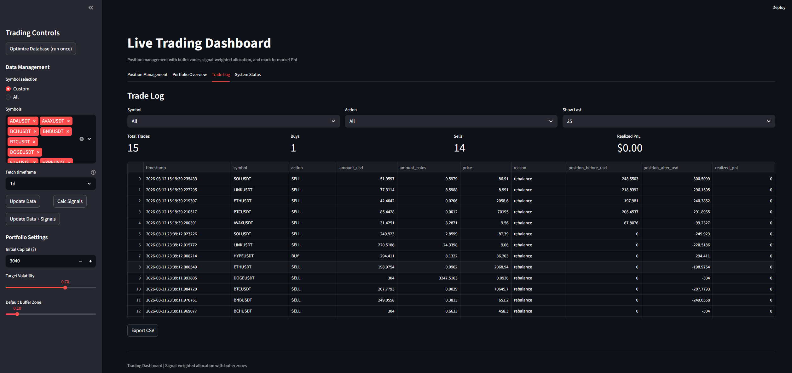
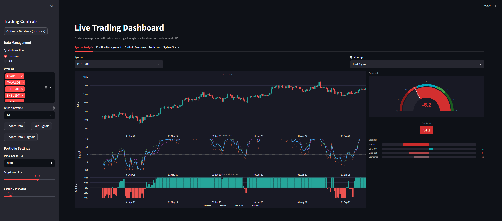

# Crypto Trend Following — Research & Live Trading Dashboard

Momentum research on cryptocurrency markets, signal construction from Robert Carver's systematic trading framework, and a live Streamlit dashboard for portfolio management with volatility-targeted position sizing.






We also created a new tab, where you can see the combined and individual forecasts as a timeseries for each coin in the trading universe. Along with that there is a relative (to the allocation weight — reminder that we equal weight all the coins from our universe) position size as a bar chart, where you can see the calculated position for each coin. This helps visualize what kind of position (both in size and in direction) we take and how price moves after our position. Or you can flip it and see what kind of positions we take because of the current price. After all we are just trend following and our position just scales based on the product of the (price constructed) signal times our volatility target exposure relative to the recent volatility.



---

## Theoretical Framework

### Data

Daily data from 2018 onwards, sourced from Bybit's API. The universe consists of the top cryptocurrencies by market capitalization (excluding stablecoins and unavailable pairs). We use USDT perpetual futures — the most liquid trading pairs.

Trend works better on lower-volatility assets, and smaller-cap coins tend to be more volatile due to thinner order books. For that reason the top-decile volatility coins are excluded from the portfolio (more on this in [Research Findings](#research-findings)).

### Signal Construction

Three momentum-based trading rules, each producing continuous (not binary) forecasts — stronger signals yield larger position sizes:

**EWMAC (Exponential Weighted Moving Average Crossover)**

Taken from Robert Carver's *Systematic Trading*. We compute exponential moving averages at two speeds and take their difference, normalized by rolling volatility. Lookback windows follow a geometric progression (2, 4, 8, 16, 32, 64, 128, 256) — this guarantees that any pair of adjacent lookbacks has the same pairwise correlation, approximately `1/sqrt(a)` where `a` is the ratio between them.

We can verify the correlation symmetry in practice:


Six EWMAC variations are used (pairs of fast/slow lookbacks): `2_8, 4_16, 8_32, 16_64, 32_128, 64_256`.

**Forecast Scaling**

All signals are scaled so the mean absolute forecast equals 10. A forecast of +10 is an average buy, -10 an average sell. Forecasts are capped at ±20 (double the average) to prevent extreme position sizes.

Scalars are computed per variation by averaging the absolute forecasts across the full universe, then dividing 10 by that average.

Distribution of average forecasts across symbols and EWMAC variations:


The scaling applies uniformly across assets.

**Weighting via Handcrafting**

Since we don't know which lookback works best (and don't want to overfit by picking the backtested winner), we weight variations by their correlation structure using Carver's handcrafting method:


Variations are split into two groups (short: `2_8, 4_16, 8_32` and long: `16_64, 32_128, 64_256`) with weights `42%, 16%, 42%` within each group, halved across groups.

We adjust weights to reduce turnover — the fastest pair (`2_8`) switches forecast far more frequently, which incurs trading costs:


Visualized for BTC/USDT:


The two fastest variations are highly correlated anyway:


So we shift weight from `2_8` to `4_16` (and symmetrically from `16_64` to `32_128`).

The combined EWMAC signal is then rescaled (multiplier ~1.30) so the combined average absolute forecast remains 10:


Resulting distribution:


**BOLMOM (Bollinger Band Momentum)**

Measures distance from a rolling mean ± 2σ band (adapted from [@ScottPh77711570](https://twitter.com/ScottPh77711570)). Equal-weighted across all lookback variations.

**Breakout**

Rolling min/max channel — calculates normalized distance from the channel midpoint. Same weight structure as EWMAC.

For BOLMOM and Breakout, the mean forecast distributes more naturally around 10 than EWMAC, likely due to the volatility and min/max components in their construction:


### Research Findings

Performance is measured via Information Coefficient (IC) — the rank correlation between forecast and subsequent returns. Framework for what constitutes "good" IC:


Trading costs assumed at 0.10% (2x Binance taker fee of 0.05%, to account for daily turnover scenarios).

Combined signal IC:


**Volatility decile analysis** confirms trend works better on lower-volatility coins. After excluding the top volatility decile:


**Volatility-adjusting** all three signals (not just EWMAC) further improves IC:

Before:


After:


Combined signal improvement (top decile excluded):


**Signal decay** — predictive power by forward horizon:


Signals are strongest within the first week and remain robust up to two weeks out.

IC before and after volatility adjustment:


**Conclusion**: Trend following produces a weak but robust edge. Performance improves significantly when adjusting for asset volatility, both in signal construction and universe selection.

### Position Sizing

With a daily forecast scaled across the universe, positions are sized using a volatility target:

1. **Block value** = daily volatility forecast (annualized) × close price — captures the expected daily cash volatility of the asset
2. **Annual cash vol target** = target volatility × trading capital (capital updates with realized PnL)
3. **Volatility scalar** = annual cash vol target / block value
4. **Position** = `(signal × vol_scalar) / 10`

The annual vol target is a long-term average — realized vol will differ because:
- Our vol forecast is naive (rolling 30-day EWM std)
- Position size depends on forecast strength, not just vol
- Portfolio-level vol is lower than the sum of individual vols due to imperfect correlation:


The variance sums only for uncorrelated assets. For correlated ones, we get the grand sum of the covariance matrix — practically always lower than the naive sum.

---

## Live Trading Dashboard

### Dashboard Tabs

| Tab | What it does |
|-----|-------------|
| **Symbol Analysis** | Candlestick charts, forecast gauge (±20 scale), signal bars (EWMAC/BOLMOM/Breakout/Combined), relative position size — all with synchronized zoom and crosshair |
| **Position Management** | Target positions, buffer zones, trade execution (individual or batch) |
| **Portfolio Overview** | M2M, exposure breakdown (net/gross/long/short), portfolio history chart |
| **Trade Log** | Filterable trade history with CSV export |
| **System Status** | Diagnostics, data quality, buffer management, portfolio reset |

### Key Features

- **Live data** from Bybit REST API (no API key needed for public market data)
- **Volatility-targeted sizing** per Carver's framework with real-time capital tracking
- **Buffer zones** to reduce turnover — trades only execute when positions breach configurable thresholds
- **Mark-to-market** with live ticker prices, correct handling of flips (long→short), partial closes, and fresh opens
- **Multi-timeframe storage**: 1d, 4h, 1h, 15m, 5m data stored separately in SQLite (WAL mode) for future strategy expansion

### Quick Start

```bash
pip install streamlit pandas numpy numba plotly requests

# Fetch price data from Bybit
python data_fetcher.py

# Launch dashboard
streamlit run dashboard.py
```

### Project Structure

```
config.py        — Strategy params, forecast scalars, symbol universe
strategy.py      — Signal generation (EWMAC, BOLMOM, BREAKOUT) + Numba backtest engine
portfolio.py     — Position sizing, trade execution, M2M, SQLite helpers
dashboard.py     — Streamlit UI (5 tabs)
data_fetcher.py  — Bybit REST API data fetcher with parallel downloads
```

---

## Future Work

- **Auto-refresh** — Scheduled data updates and M2M at configurable intervals
- **Multi-timeframe strategies** — Leverage the 4h/1h/15m data already stored for intraday signal generation
- **Cloud deployment** — Move from SQLite to a cloud DB for persistent hosted access
- **Instrument weights** — Configurable per-symbol allocation beyond equal-weight
- **Portfolio-level risk** — Correlation-aware position sizing and portfolio volatility tracking
