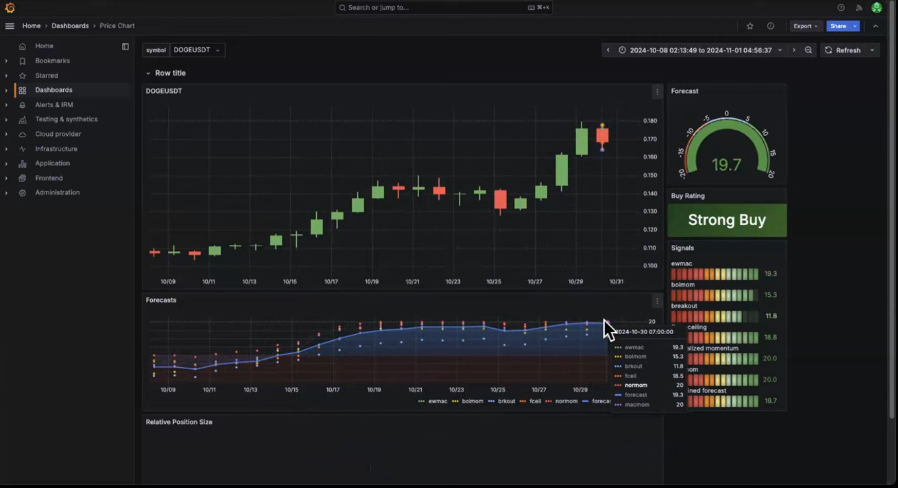
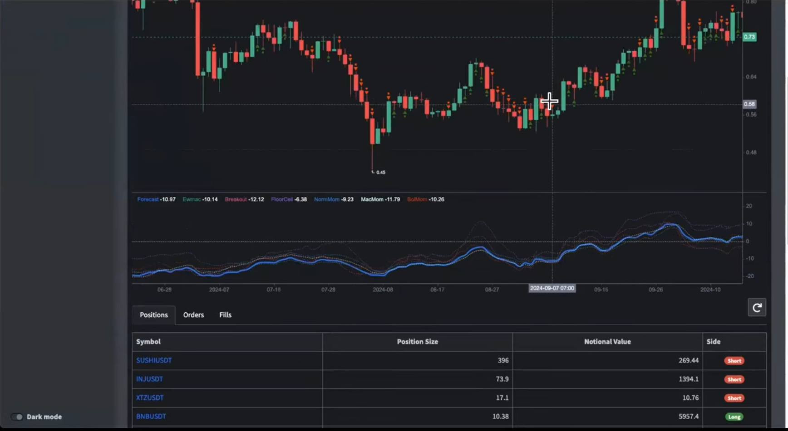

# Crypto Trading Dashboard

A live crypto trading dashboard built with Streamlit, implementing Robert Carver's systematic trading framework. Fetches data from Bybit, generates trading signals, and manages positions with volatility-targeted sizing.


## Features

### Signal Generation
- **EWMAC** (Exponentially Weighted Moving Average Crossover) across 6 speed combinations
- **BOLMOM** (Bollinger Band Momentum) across 6 lookback windows
- **BREAKOUT** (Channel Breakout) across 6 lookback windows
- Forecast scalars calibrated per Carver's methodology
- Combined signal with family-level multipliers and blending

### Position Sizing (Carver Framework)
- **Equal-weight allocation** across all active instruments
- **Volatility targeting**: block value, cash vol target, vol scalar
- `position = signal x vol_scalar / 10` (10 = average absolute forecast)
- Capital tracks with realized PnL — slider changes recalculate all targets instantly

### Live Portfolio Management
- **Mark-to-market** with real-time Bybit ticker prices (no API key needed)
- **Buffer zones** to avoid excessive rebalancing (per-symbol or bulk)
- **Execute All Trades** button for batch execution
- Correct handling of position flips (long to short), partial closes, and fresh opens
- Realized and unrealized PnL tracking

### Exposure Breakdown
- Net exposure (long vs short)
- Gross notional exposure
- Per-asset position detail with entry price, current price, and PnL %

### Data Pipeline
- Bybit REST API fetcher with parallel downloads and rate limiting
- Multi-timeframe support: 1d, 4h, 1h, 15m, 5m (stored separately in SQLite)
- WAL mode + optimized PRAGMAs for concurrent read/write
- Vectorized signal computation with batch DB writes

### Dashboard Tabs
| Tab | What it does |
|-----|-------------|
| **Position Management** | Target positions, buffer zones, trade execution (individual or all) |
| **Portfolio Overview** | M2M, exposure breakdown (net/gross/long/short), history chart |
| **Trade Log** | Filterable trade history with CSV export |
| **System Status** | Diagnostics, data quality, buffer management, portfolio reset |

## Quick Start

```bash
# Install dependencies
pip install streamlit pandas numpy numba plotly requests

# Fetch price data from Bybit
python data_fetcher.py

# Launch dashboard
streamlit run dashboard.py
```

## Project Structure

```
config.py        - Centralized configuration (strategy params, scalars, symbols)
strategy.py      - Signal generation (EWMAC, BOLMOM, BREAKOUT) + backtest engine
portfolio.py     - Position sizing, trade execution, M2M, DB helpers
dashboard.py     - Streamlit UI (4 tabs)
data_fetcher.py  - Bybit REST API data fetcher with SQLite storage
```

## Future Updates

- **UI overhaul** — Candlestick charts, forecast gauges, signal heatmaps per symbol, and relative position size visualization (inspired by the layout below)

  
  

- **Auto-refresh** — Scheduled data updates and M2M at configurable intervals
- **Multi-timeframe strategies** — Leverage the 4h/1h/15m data already being stored for intraday signal generation
- **Cloud deployment** — Move from SQLite to a cloud DB for persistent hosted access
- **Instrument weights** — Configurable per-symbol allocation weights beyond equal-weight
- **Portfolio-level risk** — Correlation-aware position sizing and portfolio volatility tracking
