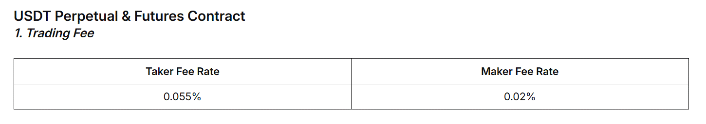

# Crypto Trend Following — Research & Live Trading Dashboard

Momentum research on cryptocurrency markets, signal construction from Robert Carver's systematic trading framework, and a live Streamlit dashboard for portfolio management with volatility-targeted position sizing.


We also created a new tab, where you can see the combined and individual forecasts as a timeseries for each coin in the trading universe. Along with that there is a relative (to the allocation weight — reminder that we equal weight all the coins from our universe) position size as a bar chart, where you can see the calculated position for each coin. This helps visualize what kind of position (both in size and in direction) we take and how price moves after our position. Or you can flip it and see what kind of positions we take because of the current price. After all we are just trend following and our position just scales based on the product of the (price constructed) signal times our volatility target exposure relative to the recent volatility.


---

## Theoretical Framework

In this repo, we will show some of the findings from momentum research on Cryptocurrency markets and then provide a simple idea on portfolio construction.
For this process two files will be created:

      1) data_fetcher : will download and store the data that we need for our analysis.

      2) strategy : will showcase the construction of our momentum signals.

      3) utilities : will assist with choosing appropriate signal weights in the portfolio.

      4) research : will show our findings.

      Files 3) and 4) are very simple and will be omitted.


**1) data fetcher:**

The function **_split_time_range** is created due to Bybit's API limit requests. For the data that we need there is a limit of 1000 data points per request.
In our research we will use daily data from 2018, with each day corresponding to one data point. So we need to split our dates in batches of 1000 days.

Then we will use the function **fetch_klines** that performs one request (of 1000 data points) and pulls data for a single coin.
From these data we will mostly use:
            **timestamp** which contains the open time in unix format (it is transformed in datetime format for readability)
            and
            **close** which is the last traded price (so happens on the closing time) for that day (identified by the opening time)

Here we need to note that the closing price is **not tradeable**, so any assumptions based on trading at that price are baseless. But we won't use it for that purposes.

The function **fetch_multi_symbol_data** performs the previous operation for multiple symbols simultaneously using a ThreadPoolExecutor and also applies the **_split_time_range** function in order to retrieve data for longer than 1000 days.

The universe selection happens at this step. The choice was made based on the top 50 by Market Capitalization from **https://coinmarketcap.com**. The reason being will be explained later in the research process, but a brief explanation is that trend works better on lower volatiltiy coins, and the smaller the Capitalization the higher the volatility due to lack of liquidity in the orderbooks. Also we will use the USDT pairs since these are the most liquid trading pairs.  Another note is that we used less than 50 coins, since some of the top 50 were stablecoins and some others weren't available on Bybit for trading.
Stablecoins are cryptocurrnecy coins that are pegged to their respective currency. For example USDT is pagged to USD (United States Dollar).

Lastly we will save our data (which are a Dictionary of DataFrames) in a pickle file, for ease of access.


**2) strategy:**

At this stage we want to create our signals or trading rules that hopefully can capture the momentum effect. What is momentum and why it happens is a good question, that has varying answers. We won't bother trying to explain possible reason for its existence.
Our assumption is that momentum exists in markets and is especially pronounced in Crypto markets and we will try to create signals that can exploit this effect.

Our first rule is taken from **Robert Carver's book Systematic Trading: A unique new method for designing trading and investing systems** and is called **EWMAC**. A form of EWMAC is widely used by CTAs (trend following funds) and is basically a moving average crossover, in our case we take an exponential moving average. We calculate the exponential moving average of the closing prices on a rolling basis. The crossover is the difference between the fastest (smaller lookback window) minus the slowest (bigger lookback window) exponential
moving average (from now on we will use exponential moving average and moving average interchangeably). Note that we take the difference and not just the binary version of whether one is bigger than the other. This is because we will construct continuous signals and not binary. The reasoning is that a continuous signal provides more information about the strength of the signal than a mere 0 or 1. Our goal is to have different posiziton size depending on the signal strength, so stronger signals will have more bigger position sizes and weaker ones will have smaller size. Finally we will standarize the moving average, using the standard deviation of returns on a rolling basis. The standard deviation of returns is basically the volatility of our asset.

How are we choosing the lookback windows? First of all there is a heuristic (taken from **https://twitter.com/macrocephalopod**) that says that for two trend signals with lookbacks n1 and n2 on the same asset the correlation of the signals is approximately min(n1, n2)/sqrt(n1 * n2). This means that if we pick the lookbacks in geometric progression (i.e. 2, 4, 8, 16, 32, 64, ...) then any pair of adjacent lookbacks will have the same correlation (which will be 1/sqrt(a), where a is the ratio of the lookback pairs).

We can see that in practice using the function **correlation_matrix_data** from **utilities**: 

**Note**: We see that the formula **1/sqrt(a)** doesn't work for pairs of adjacent lookbacks. This is because this formula works on detrended price series, but we didn't do that. We approximated that by normalizing for price and recent volatility.
Nevertheless the symmetry for adjacent lookback periods still works.

The range of the lookback windows will be from 2 to 256. The reasoning is simple: we don't know which lookback periods are the best for predicting future returns so we will try to include as many periods as possible using the previous structure in order to have an idea of the diversification (correlations) between the rule variations (different lookback window pairs).

After that our job is almost done for this rule with two major notes.

First of all on a portfolio level we want to have a universal scale in order to size accordingly our position (this is again not my idea, just an implementation from **Robert Carver**'s book). This means that we want all our trading universe to have the same values when longing/shorting a coin. An easy way to implement this, is to scale the difference so that the mean of the absolute values of all the differences is 10. So +10 is an average buy and -10 is an average sell. A forecast of +5 would be a weak buy, and -20 is a very strong sell. Later, depending on our forecast score and the expected volatility we will size our positions. Since we don't want extreme forecast values to gives us an enormous posiziton size, we will cap it at double the expected absolute value, which in our case is +/-20.
The forecast scalars are calculated by taking many coins, constructing the EWMAC rule for all the lookback windows and then taking the **average for every (lookback) pair of the absolute value of the forecasts**. Then we divide 10 (which is the expected value that we want our signals to have) with that **average** for every pair. This is our **forecast scalar**. Then we go back to the signal construction and multiply our rule variation with that **scalar**. We achieve this by using the **calculate_vol_adjusted_ewmac** and **ewmac_scalar** functions.

Below is the distribution of of our average forecast for different symbols and different ewmac variations: 


**Note:** The very low mean signal to the left is due to (WIF/USDT) pair which was listed in February of 2024, so we haven't see te full distribution of the signals for this symbol.

We see that it works as expected and the scaling applies uniformly across our assets.

Lastly, since we don't know which one of these works better and we don't want to overfit by picking the best based on backtested performance, we will try something else. We will weight them according to their correlations, which we shown for EWMAC ruyle on the
beginning.
Since we don't want to use a computational expensive method like bootstrapping, we will weight them according to the **handcrafting method** from **Robert Carver**'s book, shown in this exempt from his book:


We will split the rule variations in two groups. The first will be the shorter lookback pairs: 2_8, 4_16, 8_32 and the second will longer ones: 16_64, 32_128, 64_256. This way we can apply the handcrafting method by assigning the weights 42%, 16% and 42% in that order for the corresponding element in the two groups. Then we will divide them by 2, since we have two groups of weights. So the final weights should be:


At this stage, we have to remember that trading costs. For that reason we want to minimize our trading costs and consequently we need to know the turnover for every rule variation and include this in our weighting decision. We will use another function from **utilities**
which is called **rule_turnover**. We already suspect that the very fast lookback pairs (i.e. 2_8) will have bigger turnover than the slower pairs. In addition, these are information that could have been known ex ante, when we began to trade this strategy.
With that in mind we will show the yearly turnover aggregated for all our trading universe at this date (16th of October, 2024) and at the first year of each symbol's listing.


It is clearly shown that the the fastest pair constantly switches forecast, which incurs costs due to position adjustments.

Also we can visualize for a single asset (BTC/USDT) the different forecast variations:


For that reason and since the two rules variations are highly correlated: 


we will change the weights between 2_8 and 4_16 variation, in order to reduce trading costs. (We did the same for the 16_64 and 32_128 even though the turnover difference isn't that pronounced, for symmetry reasons. Either way this decision doesn't step from any
information that we couldn't have at the construction of our signal creation.)

Finally we can combine our EWMAC variation into a single one with the weights that we chose. The combined signal is given by the code below:


The scalar **1.30** we used at the second cell of code is to scale the combined signal so the average is still +10. To calculate this we use an excerpt, again from **Robert Carver**'s book, and apply the code below:


Below is the resulting distribution of the combined signal:


**3) research**:

Now we will check the performance of our rule. Before we measure it we need to know what constitutes "good" performance. From **https://twitter.com/macrocephalopod/status/1806436278067470524**, we can see the framework for defining good performance.


We find the costs for perpetual futures from Bybit:


We will assume the worst case, where we are liquidity takers and use market orders which cost 0.055%. We will even double the trading costs, in order to account for any cases where we need to turnover daily our positions.
So the costs will be **0.11%**.

Then, we find the average daily standard deviation of returns for all our symbols (which is our 'volatility' column):


We calculate the minimum correlation:


This is the absolute minimum, and we want to target about 1.5-2 times that:


Using **calculate_ic** from **signals** for the EWMAC rule we find out that the IC is:


We are almost at our lower limit of our target.
To try and improve its performance, we will split our coins into volatility deciles and check the IC by decile:


Our suspicions that trend works better on lowe volatility coins was correct. We now can see an improvement in performance removing the top decile:


**Note**: Since we excluded the top decile coins we need to recalculate the average daily vol. of our trading universe (which we expect to be slightly lower), in order to find the new targets for the IC:


We can clearly see the improvement in performance.

Using the same methodology we will create two more signals, **bolmom** and **breakout**.
**Bolmom** is the distance to a moving average plus (minus) two standard deviations (the rule is from **https://twitter.com/ScottPh77711570**). For this signal we will equal weight all the variations.
**Breakout** takes a rolling minimum and maximum for a desired lookback averages them and calculates the distance from them. We will use the same weights as in **vol_adjusted_ewmac_clipped_combined**.
We find out that for these two signals the mean forecast is better distributed around 10 than in EWMAC, probably due to the volatiltiy and the min/max component in the construction of the these two.


Finally we will combined these three signals into one and calculate its performance:


If we slice the top decile again:


Lastly, we check how many days out does our signals have predictive value (again we sliced the top decile, and we will exclude those coins from our portfolio).


On the construction of the EWMAC we volatiltiy standardized (returns std) the signal even after we standardized for price volatility. With that in mind and the volatility decile improvements for universe selection,
we will standardize the other two signals for asset volatility and we will check their respective performance:

**Before volatility adjustment**:


**After**:


Finally we see the improvement for the **combined signal** (sliced top vol. decile):


the non volatility adjusted was at **0.0144**

,and for different forward days:


We find out that trend features work the best at the first week and then gradually lose accuracy. Nevertheless, trend shows robustness two weeks out of the signal.

These are the features' IC before and after volatility adjustment:


We find out that trend features work the best at the first week and then gradually lose accuracy. Nevertheless, trend shows robustness two weeks out of the signal.

All in all we conclude that trend is a weak but robust edge and works better when adjusting for the volatility of the trading universe's assets.


**4) position sizing**:

We now have our daily forecast, that is scaled across our trading universe and we want to size appropriately our positions. To do this we will pick an annual volatility target that we want our capital to have
and together witht the forecast score we will determine the ideal target position.
To apply a volatility target to our position we need two things:

1) **block value**: this is the daily volatility forecast annualized times the daily close price.
   This way we get an idea of the daily cash volatility of the asset we are trading. Now we need to divide this by our **annual cash volatility target**.
2) **annual cash volatility target**: this is the annual volatility we want to target times our total trading capital. Since this will be changing based on profit/loss and we want to keep our vol. target
   the same throughout our trading course, we will calculate it based on the changing capital based on daily pnl. For that reason we will show a naive backtest to get an idea of how would it work.

Finally we calculate the **volatility scalar** which is our annual cash volatility target divided by the block value. After that our position size is a mere multiplication of the vol. scalar times our signal score, and then we divide this product with the long term average absolute value of the forecast: 10.


**Note**: The annual volatility target is a long term average and we don't expect to reach it every single year.
We need to acknowledge that:

i) our vol. forecast is a very naive one, we just use a rolling mean of the previous month's vol.

ii) our position size is a product of the forecast score too, so sometimes it might give bigger size than the vol. only calculation would allow.

iii) we expect our realized volatility on a portfolio level to be different (lower actually) than our target.

This is because our assets are correlated and so we can show that:


It is clear that the variance can be summed only for uncorrelated variables.

For the correlated case, we practically have the sum of all the elements ('grand sum') of the covariance matrix.

In this updated version we also have 3 more .py files that contain the new features from the previous TrendFollowing repo. Mainly, we stopped saving our data as a dictionary in Python and instead we are now saving them in a database. From there we can create a localhosted (for now) dashboard where we can create a trading universe, apply an annual volatility target, add our portfolio size and based on our signals to calculate target positions. While we haven't add API integration with Bybity so we can trade from the dashboard, we can "execute" the trades internally: meaning log the time, price, symbol, position size in our database so we can rebalance when new signals emerge or we are outisde the trading buffer we have set. The trading buffer is set based on our target position, where in order to minimize transaction costs, we allow our actual position to wiggle at a fixed percentage from that target. This way we make trades only at the edge of the buffer zone and we don't overtrade based on small fluctations of the signals. While there is a mathematical way to construct this buffer, we use a fixed percentage (10% of the target position) that works well enough for our type of trading (medium frequency) where turnover is daily and we don't need HFT accuracy. 

Below are the new files: 

  **config.py**

  This is where all the strategy parameters live. The signal weights for each rule (EWMAC, bolmom, breakout), the
  forecast scalars that we calculated during research, the lookback windows, the volatility target and initial capital —
   everything is centralized here. The idea is that if we want to change something about the strategy (say adjust the
  vol target or swap a coin in/out of the universe), we only need to touch this one file. It also holds the file paths
  for the database, logs, and checkpoints, so the rest of the codebase doesn't have hardcoded paths scattered around.

  **portfolio.py**

  This handles everything related to live portfolio management. It connects to a local SQLite database (using WAL mode
  for concurrent reads) where it stores current positions, trade logs, daily portfolio snapshots, and strategy signals.
  The main class PortfolioManager tracks capital, computes target positions from the forecast and volatility scalar,
  applies buffer zones so we don't trade on every small signal change, and executes trades when positions breach the
  buffer edges. It also does mark-to-market by pulling live prices from Bybit's REST API and correctly handles position
  flips (e.g. going from long to short), partial closes, and fresh opens — logging realized PnL at each step. There's
  also a Numba-accelerated backtest function in there for running historical simulations across multiple symbols.

  **dashboard.py**

  This is the Streamlit app that ties everything together into an interactive UI. It has five tabs: Symbol Analysis
  (candlestick charts with synced crosshair, a forecast gauge, individual signal bars and relative position size),
  Position Management (target vs current positions, buffer zones, trade execution either per-symbol or in batch),
  Portfolio Overview (mark-to-market, exposure breakdown by long/short/net/gross, portfolio equity curve), Trade Log
  (filterable history with CSV export), and System Status (data quality checks, buffer management, database
  optimization). The sidebar lets you select which symbols to track, fetch new data from Bybit, compute signals, and run
   mark-to-market — all with a single click. Data is cached with TTL so the dashboard stays responsive without hitting
  the database on every interaction.


---

## Live Trading Dashboard

### Dashboard Tabs

| Tab | What it does |
|-----|-------------|
| **Symbol Analysis** | Candlestick charts, forecast gauge (±20 scale), signal bars (EWMAC/BOLMOM/Breakout/Combined), relative position size — all with synchronized zoom and crosshair |
| **Position Management** | Target positions, buffer zones, trade execution (individual or batch) |
| **Portfolio Overview** | M2M, exposure breakdown (net/gross/long/short), portfolio history chart |
| **Trade Log** | Filterable trade history with CSV export |
| **System Status** | Diagnostics, data quality, buffer management, portfolio reset |

### Key Features

- **Live data** from Bybit REST API (no API key needed for public market data)
- **Volatility-targeted sizing** per Carver's framework with real-time capital tracking
- **Buffer zones** to reduce turnover — trades only execute when positions breach configurable thresholds
- **Mark-to-market** with live ticker prices, correct handling of flips (long→short), partial closes, and fresh opens
- **Multi-timeframe storage**: 1d, 4h, 1h, 15m, 5m data stored separately in SQLite (WAL mode) for future strategy expansion

### Quick Start

```bash
pip install streamlit pandas numpy numba plotly requests

# Fetch price data from Bybit
python data_fetcher.py

# Launch dashboard
streamlit run dashboard.py
```

### Project Structure

```
config.py        — Strategy params, forecast scalars, symbol universe
strategy.py      — Signal generation (EWMAC, BOLMOM, BREAKOUT) + Numba backtest engine
portfolio.py     — Position sizing, trade execution, M2M, SQLite helpers
dashboard.py     — Streamlit UI (5 tabs)
data_fetcher.py  — Bybit REST API data fetcher with parallel downloads
```

---

## Future Work

- **Trading from dashboard** — Connect to Bybit and execute trades from our dashboard
- **Auto-refresh** — Scheduled data updates and M2M at configurable intervals
- **Multi-timeframe strategies** — Leverage the 4h/1h/15m data already stored for intraday signal generation
- **Cloud deployment** — Move from SQLite to a cloud DB for persistent hosted access
- **Instrument weights** — Configurable per-symbol allocation beyond equal-weight
- **Portfolio-level risk** — Correlation-aware position sizing and portfolio volatility tracking
